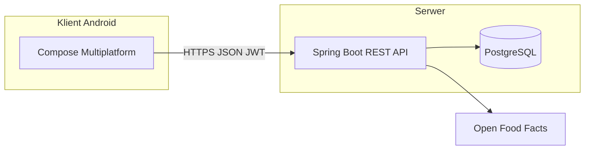

# 1. Wprowadzenie

## 1.1 Cel projektu

**Bowly** to aplikacja do śledzenia kalorii i makroskładników, zaprojektowana dla gospodarstw domowych korzystających z **własnego serwera** (self-hosted). Użytkownicy logują posiłki w dzienniku, definiują produkty i przepisy, a kluczową cechą są **wirtualne patelnie** (*batch meals*) — gotujesz raz większą porcję, a przez kolejne dni nakładasz porcje na talerz bez ponownego liczenia makro.

## 1.2 Zakres systemu

System składa się z dwóch głównych komponentów:

- **Backend** — REST API, autentykacja JWT, logika patelni, migracje bazy (Flyway).
- **Frontend** — aplikacja Android (Kotlin Multiplatform + Compose), komunikacja przez Ktor.

Backend i frontend są w **osobnych repozytoriach GitHub**; lokalnie frontend może leżeć w katalogu `bowly/` (gitignored w repo backendu).

## 1.3 Grupa docelowa

Aplikacja jest przeznaczona dla użytkowników technicznie świadomych, którzy chcą:
- trzymać dane u siebie (bez chmury SaaS),
- współdzielić produkty i patelnie w rodzinie,
- ważyć porcje (integracja z wagą poprzez gramy, tara naczyń).

## 1.4 Wersja 1.1 — główne rozszerzenia

W wersji 1.1 dodano m.in.:
- zarządzanie **naczyniami** (tara) ze zdjęciem,
- edycję **wagi gotowej** sekcji patelni,
- tworzenie patelni **bez** obowiązkowego zapisu przepisu,
- wylogowanie z **zachowaniem adresu serwera**,
- poprawki UX (scroll, daty, komunikaty błędów).
