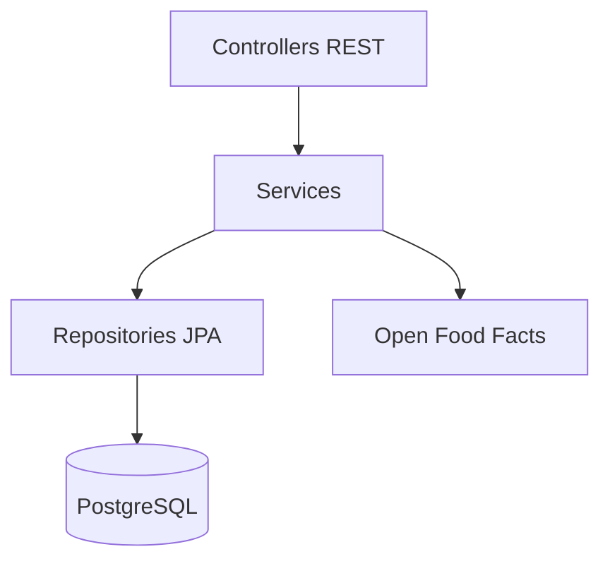

# 3. Technologie

## 3.1 Backend

| Warstwa | Technologia | Wersja (projekt) |
|---------|-------------|-----------------|
| Język | Kotlin | 2.2.21 |
| Framework | Spring Boot | 4.0.6 |
| API | Spring Web (REST) | — |
| Bezpieczeństwo | Spring Security + JWT (jjwt) | 0.12.5 |
| ORM | Spring Data JPA / Hibernate | — |
| Baza | PostgreSQL | 15 |
| Migracje | Flyway | V1–V10 |
| HTTP zewnętrzny | WebClient (Open Food Facts) | — |
| Build | Gradle | 9.4.1 |
| Runtime | JDK | 17 (Docker) |

## 3.2 Frontend (bowlyApp)

| Warstwa | Technologia | Wersja |
|---------|-------------|--------|
| Platforma | Kotlin Multiplatform | 2.1.0 |
| UI | Compose Multiplatform + Material 3 | 1.7.3 |
| Android | AGP, minSdk 31, targetSdk 35 | 8.7.3 |
| Sieć | Ktor Client | 3.0.1 |
| Serializacja | kotlinx.serialization | 1.7.3 |
| Daty | kotlinx-datetime | 0.6.1 |
| Stan | ViewModel + StateFlow | lifecycle 2.8.4 |
| Persistencja | multiplatform-settings | 1.2.0 |
| Barcode (Android) | ML Kit + CameraX | — |

## 3.3 DevOps

| Element | Narzędzie |
|---------|-----------|
| Konteneryzacja | Docker Compose (`compose.yaml`) |
| CI backend | GitHub Actions — `test.yml` |
| CI frontend | GitHub Actions — `test.yml`, `release-apk.yml` |
| Testy integracyjne DB | Testcontainers (PostgreSQL) |

## 3.4 Diagram warstw backendu

