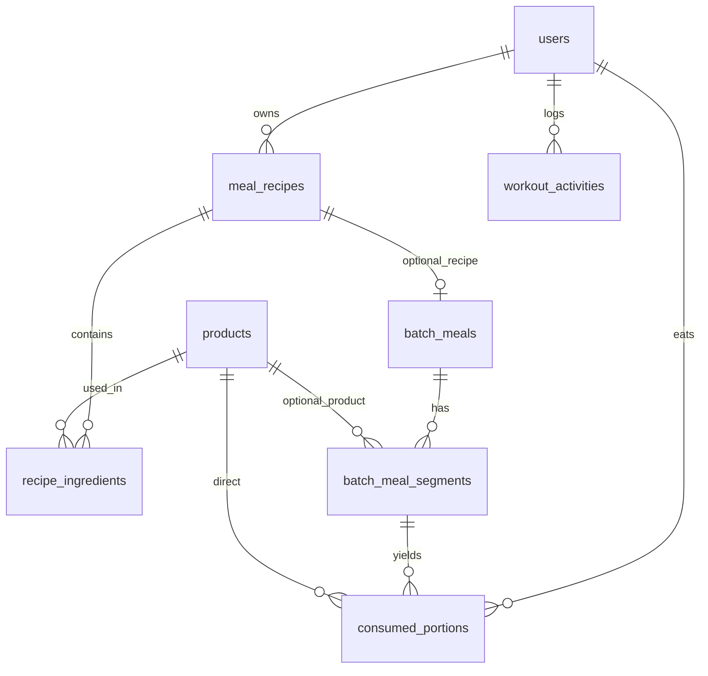

# 5. Schemat bazy danych

Schemat zarządzany wyłącznie przez **Flyway** (`spring.jpa.hibernate.ddl-auto=validate`). Migracje: `src/main/resources/db/migration/V1` … `V10`.

## 5.1 Diagram ER



## 5.2 Tabele

| Tabela | Opis |
|--------|------|
| `users` | Konta, role, profil (TDEE, makro, motyw) |
| `products` | Produkty lokalne / cache z OFF (makro na 100 g, barcode) |
| `meal_recipes` | Przepisy użytkownika |
| `recipe_ingredients` | Składniki z `section_name` |
| `batch_meals` | Patelnie |
| `batch_meal_segments` | Sekcje patelni (waga, makro, `raw_weight_g`) |
| `consumed_portions` | Wpisy dziennika (`weight_basis_g` — snapshot patelni) |
| `workout_activities` | Aktywność fizyczna per dzień |
| `weighing_containers` | Naczynia / tara (V10) |
| `app_settings` | Ustawienia globalne instancji |

## 5.3 Historia migracji

| Migracja | Zmiana |
|----------|--------|
| V1 | Schemat bazowy |
| V2 | Role, `app_settings` |
| V3 | Profil użytkownika, produkt w dzienniku |
| V5 | Barcode produktów |
| V6 | Własność przepisów, sekcje |
| V7 | Precyzja makro (double) |
| V8 | Treningi |
| V9 | Jednostki produktu (`unit_name`, `unit_weight_g`) |
| V10 | `weight_basis_g`, `raw_weight_g`, `weighing_containers` |

## 5.4 Przykład migracji V10

```sql
ALTER TABLE consumed_portions ADD COLUMN weight_basis_g DOUBLE PRECISION;
ALTER TABLE batch_meal_segments ADD COLUMN raw_weight_g DOUBLE PRECISION;

CREATE TABLE weighing_containers (
    id BIGSERIAL PRIMARY KEY,
    name VARCHAR(255) NOT NULL,
    type VARCHAR(50) NOT NULL,
    weight_g DOUBLE PRECISION NOT NULL CHECK (weight_g > 0),
    image_base64 TEXT,
    created_at TIMESTAMP DEFAULT CURRENT_TIMESTAMP
);
```

Plik: `src/main/resources/db/migration/V10__segment_weight_basis_and_containers.sql`
