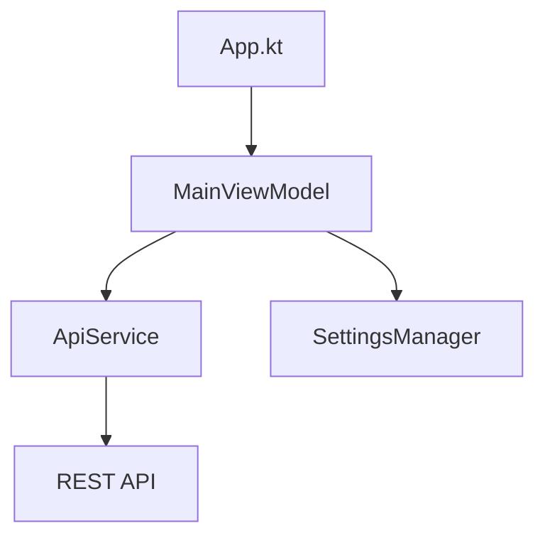

# 7. Frontend — architektura i kod

Repozytorium: [bowlyApp](https://github.com/DunderTheDragon/bowlyApp)  
Moduł: `composeApp` (Kotlin Multiplatform, target Android + iOS).

## 7.1 Wzorzec architektury

**MVVM z jednym ViewModelem:**
- `MainViewModel` — stan aplikacji, wywołania API, cache list.
- Ekrany — funkcje `@Composable` z parametrem `viewModel`.
- Nawigacja — `enum class Screen` + `mutableStateOf` w `App.kt` (bez Navigation Compose).



## 7.2 Stany aplikacji

```kotlin
sealed class AppState {
    object Loading : AppState()
    object EnterServerAddress : AppState()
    object LoginRequired : AppState()
    object Authenticated : AppState()
}
```

Przy starcie `checkStatus()` weryfikuje URL serwera i ważność JWT (GET profile).

## 7.3 ApiService — warstwa HTTP

Klasa `ApiService` opakowuje Ktor Client z JSON (kotlinx.serialization). Opcjonalny `HttpClient` w konstruktorze umożliwia testy z `MockEngine`.

```kotlin
class ApiService(
    private val baseUrl: String,
    private val token: String? = null,
    httpClient: HttpClient? = null
) {
    suspend fun getStatus(): SystemStatusResponse =
        client.get("$baseUrl/api/system/status").body()
    // ...
}
```

## 7.4 Logout a adres serwera

`SettingsManager.clearSession()` czyści tylko token/login/rolę — **nie** `BASE_URL`. `MainViewModel.logout()` wraca do `LoginRequired` z zachowanym adresem.

## 7.5 Patelnie — helpery UI

Logika przygotowania requestu wydzielona do `BatchMealHelpers.kt`:

```kotlin
fun buildCreateBatchMealRequest(
    mealName: String,
    sections: List<SectionData>,
    saveAsRecipe: Boolean,
    ...
): CreateBatchMealRequest
```

Walidacja sekcji: `validateBatchMealSections()` — min. jedna sekcja z wagą > 0 g.

## 7.6 Makroskładniki profilu

`MacroRatioUtils.kt` — normalizacja proporcji do 100%, wyświetlanie bez błędów zaokrągleń (`toDisplay()`), interaktywna regulacja (`adjustMacroRatios`).

## 7.7 Ekrany (pliki)

| Plik | Rola |
|------|------|
| `App.kt` | Routing, motyw, bottom nav |
| `AuthScreens.kt` | URL serwera, login, rejestracja |
| `DashboardScreen.kt` | Dziennik, dzień, treningi |
| `BatchMealsScreen.kt` | Patelnie, dialogi, tara per sekcja |
| `AddMealSelectionScreen.kt` | Dodawanie posiłku, skaner |
| `MyContainersScreen.kt` | CRUD naczyń |
| `ProfileScreen.kt` | Profil, TDEE |

## 7.8 Android — platforma

- `MainActivity.kt` — entry point Compose.
- `ImagePlatform.android.kt` — wybór/kompresja zdjęć naczyń.
- ML Kit + CameraX — skaner kodów kreskowych.
